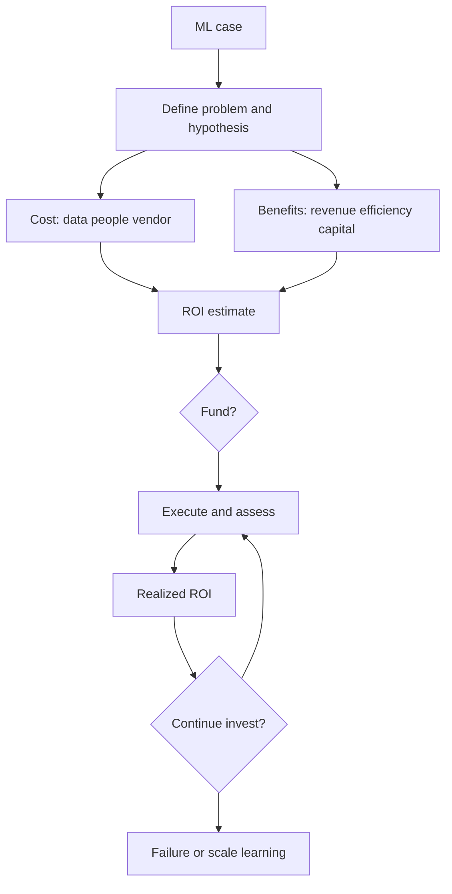

# Quantara

**Source:** `ai-in-enterprise/deloitte-TG_Google Machine Learning report_Digital Final/`
**Domain:** `ai-enterprise`
**One-liner:** An ML business-case ledger that estimates and tracks first-year ROI across revenue, time/efficiency, and capital-savings benefits against data, people, and vendor investment costs — then prioritises where to invest using a readiness framework.
**Wedge:** Finance-paired digital/analytics leaders evaluating their first or next wave of ML projects ($100k–few million) who need comparable ROI maths before committing, not another model catalog.
**Positioning:** ML investment quantification and prioritisation. Distinct from Valorink (multiplicative insights-chain health and P&L attribution across data→process), Triara (enterprise AI risk/talent portfolio), and Situara (real-time actioning). Quantara is grounded in Deloitte Access Economics’ database of 50+ ML applications and the Google Cloud–sponsored *Business impacts of machine learning* framework: benefits of US$250k–$20M, first-year ROI typically 2–5× cost, ~12-month project duration, MLaaS market from US$1.07B (2016) toward US$20B (2025).

## Market research synthesis

### Thesis from source

The report treats machine learning as a method that automates analytical model building from large datasets, accelerating business-model change. An MIT Technology Review survey cited finds 60% of leading businesses already implemented an ML strategy with ongoing investment. Benefits cluster into three families: **revenue and growth** (predict outcomes, personalise engagement, market intelligence, competitive advantage); **time and efficiencies** (process, labour, value-chain); and **capital savings** (optimise inputs, maintain assets, quality control). Costs cluster into **data**, **human resources**, and **third-party vendors**, with implementation alone able to reach ~40% of total project cost.

Deloitte Access Economics compiled 50+ global ML applications to estimate ROI as first-year dollar return divided by total project investment to date. Typical first-year ROI ranges ~2–5× depending on industry and implementation success; benefits often fall between US$250,000 and US$20 million, with some multi-year transformative bets aiming at billions. Small projects cost a few hundred thousand dollars; enterprise projects a few million. Average successful development-to-implementation runs ~12 months, varying with problem complexity, data structure, customisation, and “ML teachers.” The report is explicit that abandoned projects are excluded from the database — so product ROI claims must separate *realized* from *survivor-biased* benchmarks.

“Where to invest” is a readiness framework: develop technical capability; identify/define the problem (hypothesis, experiment measures, benchmarks, data availability); execute (vendor choice, accelerated learning, feedback); assess and iterate (algorithm fitness, hypothesis validity, continue-to-invest decision); and organise executive transformation. Quantara productises that evaluation loop as a system of record for ML cases.

### Buyer & economic model

- **Primary buyer:** CFO-aligned Head of Analytics / Digital with authority to approve ML project funding.
- **Users:** ML product owners; data science leads; procurement/vendor managers; finance controllers; LOB sponsors.
- **Budget owner / value metric:** Analytics/digital CapEx+OpEx. Value metric is *realized first-year ROI vs case estimate* and *share of spend in priority-ready problems* (hypothesis + data + benchmark present).
- **Competing status quo:** Business-case PowerPoints; vendor ROI calculators; project trackers without benefit-family taxonomy; survivor-biased anecdotal benchmarks.

### Domain constraints

- **Regulatory / trust / safety:** Benefit claims used in investor or board materials need auditability; customer-personalisation use cases inherit privacy constraints.
- **Data sensitivity:** Cost structures and realized ROI by use case are competitively sensitive.
- **Change-management realities:** Teams pad benefits; vendors quote best-case 5× ROI; failed projects disappear from institutional memory.

## Business requirements

- BR-1: Every ML case records benefit families (revenue, efficiency, capital) with measurable hypotheses and baselines.
- BR-2: Investment costs split into data, human resources, and vendor, with implementation share visible.
- BR-3: First-year ROI is computed consistently (return ÷ investment to date) and labelled estimate vs realized.
- BR-4: Benchmark ranges from research (2–5×, $250k–$20M benefits) are shown as context, never as guaranteed outcomes.
- BR-5: Cases missing hypothesis, benchmark, or data-availability answers cannot leave “define” stage.
- BR-6: Vendor selection records customisation level and expected duration against the ~12-month norm.
- BR-7: Continue-to-invest decisions are gated on assess/iterate outcomes, not sunk cost.
- BR-8: Abandoned/failed cases remain in the ledger for organisational learning (counter survivor bias).
- BR-9: Portfolio view prioritises ready problems over charismatic ones.
- BR-10: Executive transformation readiness (sponsorship, operating-model change) is scored per case.
- BR-11: Currency and FX for multi-country cases are normalised for portfolio rollups.
- BR-12: Audit pack can reconstruct estimate assumptions and realized actuals per case.

## User stories

Canonical user stories live in sibling [USER_STORIES.md](USER_STORIES.md).

## System design

### Overview

Quantara is a case ledger with staged readiness (capability → define → execute → assess → transform), benefit and cost structures, ROI estimate/realized tracking, portfolio prioritisation, and learning from failures.

### Actors & boundaries

- **Actors:** Analytics lead, DS/ML owners, finance, procurement, sponsors.
- **Trust boundary:** Case-level economics restricted; portfolio aggregates for exec forums.
- **Human-in-the-loop points:** Stage exits, funding, continue-to-invest, failure classification.

### Core capabilities

1. ML case register
2. Benefit family modelling
3. Investment cost breakdown
4. ROI estimate and realization
5. Readiness stage gates
6. Vendor/duration tracking
7. Portfolio prioritisation
8. Failure and learning ledger
9. Executive transformation scoring
10. Audit packs

### Conceptual data

- **Primary entities:** MlCase, BenefitLine, CostLine, RoiSnapshot, ReadinessStage, VendorEngagement, PrioritisationScore, FailureRecord, AuditEntry.
- **Critical events:** case opened; define complete; funded; realized ROI posted; continue/stop decided; failure logged.
- **Retention / audit needs:** Assumptions and actuals retained across funding cycles.

### Integrations (conceptual)

- **Systems of record:** Finance ERP; project portfolio; vendor contracts; experiment tracking.
- **Upstream signals:** Actual revenue/efficiency/capital metrics; timesheets; invoices.
- **Downstream actions:** Funding releases; stop-invest; board ROI packs.

### High-level architecture

### Success metrics

- **Leading:** % cases passing define gate first time; estimate completeness; median planned duration vs 12-month norm.
- **Lagging:** Realized vs estimated first-year ROI; share of spend in priority-ready cases; failure-ledger coverage.

## OpenAPI skeleton

Canonical HTTP surface lives in sibling `openapi.yaml`. Summarize here:

- **Base path:** `/v1/...`
- **Auth:** `ApiKeyAuth` for ERP/metric integrations; `BearerAuth` for analytics, finance, sponsors.
- **Resource groups:** Cases, Benefits, Costs, ROI, Readiness, Vendors, Portfolio, Governance.
