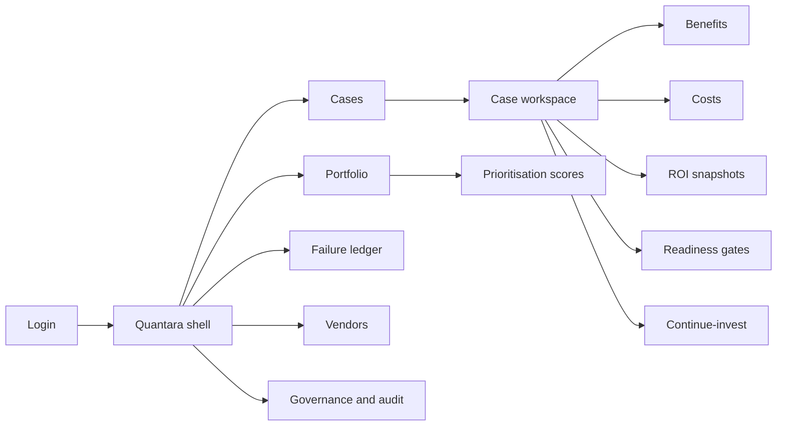
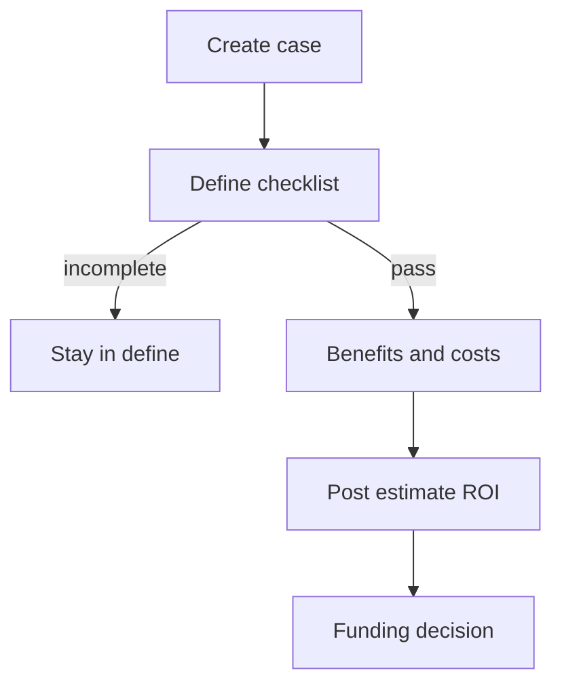
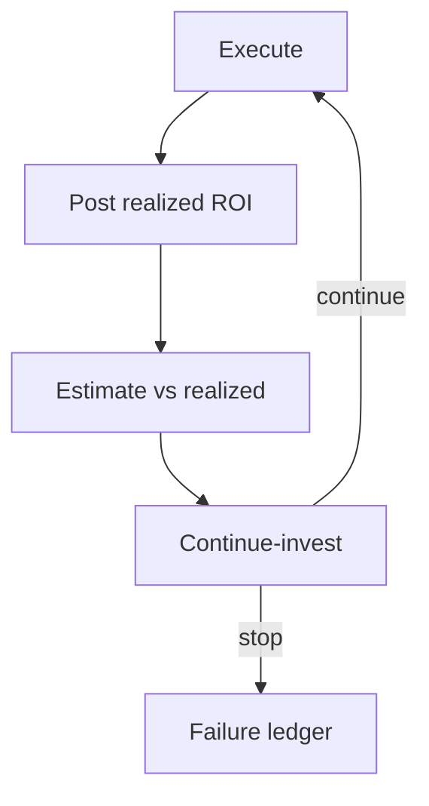

# Quantara — Web app

**Product:** [PRODUCT.md](./PRODUCT.md)
**Primary surface:** ML investment case ledger (analytics + finance co-owned console)
**Secondary surfaces:** Board/audit pack export viewer (read-only PDF); sponsor briefing share link (read-only portfolio slice)
**Design thesis:** Quantara is a finance ledger for ML bets — not a model zoo. The UI metaphor is a staged investment casebook: every case walks capability → define → execute → assess → transform with benefit families and cost lines as first-class columns. Visual language is cool graphite ink on warm paper-white panels with ledger-teal for realized ROI and caution-amber for estimate-only figures, so folklore 2–5× never masquerades as booked returns. Abandoned cases stay visible as struck learning rows — survivor bias is a first-class design enemy.

## UX research synthesis

### Category peers (best-in-class)

- **Apptio (TBM Studio):** Cost towers and investment views that force comparable taxonomy before portfolio chat. Steal: standardised cost components (data / people / vendor) as columns finance already trusts; reject Apptio’s IT-tower jargon where Quantara speaks benefit families.
- **Planview / Broadcom Clarity PPM:** Gate-driven stage exits and funding decisions on portfolio objects. Steal: cannot-advance-without-checklist pattern for define-stage; reject resource-level capacity grids as the home surface.
- **Anaplan / Pigment:** Side-by-side plan vs actual with assumption lineage. Steal: estimate vs realized ROI as twin columns with drill to assumption packs; reject sprawling multi-module planning canvases for v1.
- **Productboard (Prioritization):** Explicit scoring that separates “charismatic” from “ready.” Steal: readiness-weighted portfolio sort over vanity impact scores; reject roadmap swimlanes as the primary metaphor.

### Patterns to adopt / reject

- **Adopt:** Stage-gated case editor; benefit-family and cost-component ledgers; estimate vs realized labelling on every ROI numeral; research benchmark bands as context chips (never guarantees); failure ledger as nav, not a soft-delete archive; continue-to-invest as an explicit decision object; FX-normalised portfolio rollups.
- **Reject:** Model-registry aesthetics (experiments, endpoints, drift charts as home); vendor ROI calculator widgets that hide cost share; purple “AI insights” scorecards; editable realized totals; hiding abandoned cases; dashboard-of-everything replacing the casebook.

### Trust, density, and workflow constraints from PRODUCT.md

Finance and analytics share one system of record (BR-1–BR-3): density must support board packs without exposing peer LOB commercial detail beyond role scope. Survivor bias is a product requirement (BR-8): failed cases remain queryable and visually distinct. Define-stage incompleteness blocks funding (BR-5). Benchmark ranges from research are context only (BR-4). Continue-to-invest cannot default to renew (BR-7). Audit packs must reconstruct assumptions (BR-12).

## Information architecture

### Nav model

### Roles → default home

| Role | Default home | Why |
|------|--------------|-----|
| Head of Analytics | Portfolio — readiness-weighted | Stop funding unready problems (BR-9) |
| Finance controller | Portfolio — estimate vs realized | Recalibrate 2–5× folklore (BR-3) |
| ML product owner | Cases — define checklist | Forced hypothesis/data/benchmark (BR-5) |
| Vendor / procurement manager | Vendors | Comparable customisation and duration (BR-6) |
| Executive sponsor | Case briefing / transformation score | P&L line clarity and change readiness (BR-10) |
| Platform admin / audit | Governance and audit | Reconstruct assumptions (BR-12) |

### Cross-links to OpenAPI resources

| Nav area | OpenAPI tags / resources |
|----------|---------------------------|
| Cases | Cases |
| Benefits | Benefits |
| Costs | Costs |
| ROI snapshots | ROI |
| Readiness gates | Readiness |
| Vendors | Vendors |
| Portfolio scores | Portfolio |
| Failure ledger | Governance (failures) |
| Audit entries | Governance |

## Screen inventory

### Portfolio home

- **Purpose:** Answer “where should next ML dollars go?” by readiness, not charisma.
- **Entry:** Default for analytics lead and finance.
- **Layout regions:** Brand + period/FX controls; prioritisation table (readiness, estimate ROI, realized ROI, stage, transform score); filter chips (benefit family, LOB, stage); alert rail (define-blocked cases, continue-invest due).
- **Primary actions:** Open case; export board pack; jump to failure ledger.
- **Empty / loading / error:** Empty = “open first ML case” with define checklist preview; loading = skeleton rows; error = retry with request id.
- **BR / story ties:** BR-9, BR-11; analytics and finance stories.

### Case list

- **Purpose:** Browse all cases including abandoned; filter by stage and outcome.
- **Entry:** Nav → Cases.
- **Layout regions:** Filterable table with stage badge, estimate/realized ROI labels, failure flag; bulk export.
- **Primary actions:** Create case; open workspace; mark abandoned (keeps row).
- **Empty / loading / error:** Empty = template picker by benefit family; abandoned filter always available.
- **BR / story ties:** BR-8; analytics lead survivor-bias story.

### Case workspace (overview)

- **Purpose:** Single composition for one ML bet: stage, hypothesis status, economics summary, continue-invest state.
- **Entry:** From portfolio or case list.
- **Layout regions:** Stage stepper (capability → define → execute → assess → transform); economics strip (benefits total, costs total, ROI with estimate/realized badge); hypothesis summary; vendor duration vs 12-month norm; transform readiness score.
- **Primary actions:** Advance stage (gated); post ROI snapshot; open continue-invest; generate audit pack.
- **Empty / loading / error:** Incomplete define = blocking banner listing missing checklist items.
- **BR / story ties:** BR-5, BR-6, BR-7, BR-10.

### Benefits editor

- **Purpose:** Model revenue, efficiency, and capital benefit lines with hypotheses and baselines.
- **Entry:** Case workspace → Benefits.
- **Layout regions:** Benefit-family tabs; line table (hypothesis, baseline, measure, expected $); research context band ($250k–$20M) as non-guarantee chip.
- **Primary actions:** Add line; attach measure source; save.
- **Empty / loading / error:** Empty = pick family wizard; validation if hypothesis blank.
- **BR / story ties:** BR-1, BR-4.

### Costs editor

- **Purpose:** Split investment into data, human resources, and vendor with implementation share visible.
- **Entry:** Case workspace → Costs.
- **Layout regions:** Cost-component columns; implementation-share callout (~40% warning when high); currency/FX fields.
- **Primary actions:** Add cost line; link invoice/timesheet ref; save.
- **Empty / loading / error:** Empty = three-component starter rows; error on FX missing for multi-country.
- **BR / story ties:** BR-2, BR-11; product owner implementation-share story.

### ROI snapshots

- **Purpose:** Compute and history first-year ROI as return ÷ investment to date; separate estimate from realized.
- **Entry:** Case workspace → ROI; portfolio drill.
- **Layout regions:** Timeline of snapshots; estimate vs realized dual display; formula disclosure; benchmark band context.
- **Primary actions:** Post estimate; post realized; export for board.
- **Empty / loading / error:** No costs/benefits = cannot compute; clear error state.
- **BR / story ties:** BR-3, BR-4.

### Readiness gates

- **Purpose:** Enforce define checklist and later stage exits before funding or continue.
- **Entry:** Case workspace stage stepper.
- **Layout regions:** Checklist (hypothesis, measures, benchmarks, data availability); capability and transform questions; pass/fail with blocker list.
- **Primary actions:** Submit stage exit; request exception (audited).
- **Empty / loading / error:** Failed gate = cannot leave define (BR-5).
- **BR / story ties:** BR-5, BR-10.

### Vendor engagements

- **Purpose:** Compare vendors on customisation and expected duration against ~12-month norm.
- **Entry:** Nav → Vendors or case → Vendors.
- **Layout regions:** Engagement table; customisation level; duration vs norm indicator; cost link.
- **Primary actions:** Add engagement; flag renewal for continue-invest review.
- **Empty / loading / error:** Empty = “no vendor yet — in-house or select.”
- **BR / story ties:** BR-6; procurement stories.

### Continue-to-invest decision

- **Purpose:** Explicit stop/scale/renew decision gated on assess outcomes, not sunk cost.
- **Entry:** Case assess stage CTA; vendor renewal flag.
- **Layout regions:** Assess summary; options (continue / stop / pivot); rationale; impact on portfolio.
- **Primary actions:** Record decision; notify sponsor; if stop, route to failure ledger classification.
- **Empty / loading / error:** Missing assess ROI = blocked.
- **BR / story ties:** BR-7.

### Failure ledger

- **Purpose:** Organisational learning surface for abandoned/failed cases — counter survivor bias.
- **Entry:** Nav → Failure ledger; from stop decision.
- **Layout regions:** Failure table (reason codes, stage at fail, estimate that was wrong); learning notes; link back to case (not deleted).
- **Primary actions:** Classify failure; add learning; include in audit pack.
- **Empty / loading / error:** Empty = healthy message that failures will appear here (not “all clear, hide this”).
- **BR / story ties:** BR-8.

### Governance and audit

- **Purpose:** Reconstruct estimate assumptions and realized actuals per case for board/investor materials.
- **Entry:** Nav → Governance; case → Audit pack.
- **Layout regions:** Audit entry list; pack builder (case slice + assumptions + snapshots); integrity status.
- **Primary actions:** Generate pack; export PDF; verify lineage.
- **Empty / loading / error:** Pack incomplete = list missing artifacts.
- **BR / story ties:** BR-12.

### Sponsor briefing (secondary)

- **Purpose:** Read-only share of capital vs efficiency vs revenue and transform readiness for one case or portfolio slice.
- **Entry:** Share link from case or portfolio export.
- **Layout regions:** Brand-forward header; benefit family breakdown; ROI estimate/realized; transform score; no edit controls.
- **Primary actions:** Download PDF; request access upgrade.
- **Empty / loading / error:** Expired link message.
- **BR / story ties:** Executive sponsor stories; BR-10.

## Key flows

1. **Open and fund a case** — create case → complete define checklist → model benefits/costs → post estimate ROI → readiness pass → fund; failure: missing hypothesis/data/benchmark blocks stage exit.

2. **Realize and recalibrate** — execute → post realized ROI → compare to estimate → continue/stop; failure: realized without cost actuals rejected.

3. **Portfolio prioritisation** — score ready problems → sort spend → export board pack with FX rollup (BR-9, BR-11).

4. **Vendor renewal gate** — engagement nearing end → continue-invest required → decision logged (BR-6, BR-7).

5. **Audit reconstruction** — select case → assemble assumptions + snapshots + failure notes → export pack (BR-12).

## Design system

### Tokens (CSS variables)

- `--color-ink: #1A2332` — primary text
- `--color-paper: #F7F5F0` — app ground (warm paper, not cream-serif marketing cliché)
- `--color-panel: #FFFFFF` — case panels
- `--color-rule: #D4D0C8` — ledger rules
- `--color-teal: #0F7A6B` — realized / booked confirmation
- `--color-teal-soft: #D8EEE9` — realized chip fill
- `--color-amber: #C4831A` — estimate-only / provisional
- `--color-coral: #C45C4A` — blocked gate / failure
- `--color-steel: #5C6B7A` — secondary labels
- `--color-brand: #0F7A6B` — Quantara wordmark
- `--font-display: "Source Serif 4", serif` — case titles and ROI numerals (investment-memo feel)
- `--font-body: "IBM Plex Sans", sans-serif` — UI chrome and tables
- `--font-mono: "IBM Plex Mono", monospace` — case ids, FX, audit hashes
- `--space-1`…`--space-8`: 4px scale
- `--radius-sm: 4px`; `--radius-md: 6px` — sharp casebook, not pill-heavy
- `--motion-stage: 200ms ease-out` — stage stepper advance
- `--motion-realize: 220ms ease-out` — estimate→realized label flip
- `--motion-block: 180ms ease-in` — gate-block banner appear
- Atmosphere: faint ruled-ledger horizontal lines in paper ground; soft left brand rail; no stock “AI brain” imagery.

### Typography & brand

- Serif display for case names and primary ROI figures; sans for navigation and forms; mono for ids and packs.
- Brand wordmark always present in shell chrome on money-bearing views; never replaced by generic “Dashboard.”
- Login/marketing shell: brand hero + one line (“ML cases with finance-grade ROI”) + one CTA — no KPI tile walls.

### Do / don’t

- **Do:** Label every ROI as estimate or realized; keep failed cases visible; show implementation cost share; put research bands in context chips; gate define exits.
- **Don’t:** Purple AI glow; hide abandoned work; treat vendor calculator outputs as realized; model-registry home; card grids of static vanity metrics; emoji status.

### Accessibility & domain trust cues

- Contrast AA+ for teal/amber/coral on paper; estimate vs realized also differs by text label and icon, not colour alone.
- Live regions announce gate failures and continue-invest deadlines.
- Focus order follows money: define → benefits/costs → ROI → fund → assess.
- Audit packs expose machine-readable lineage for controllers.

## Component patterns

- **BenefitFamilyLedger** — revenue / efficiency / capital line editor with hypothesis fields.
- **CostComponentSplit** — data / people / vendor with implementation-share callout.
- **RoiEstimateRealizedPair** — twin numerals with mandatory labels.
- **BenchmarkContextChip** — 2–5× / $250k–$20M as non-guarantee context.
- **ReadinessGateChecklist** — blocking define items.
- **StageStepper** — capability → define → execute → assess → transform.
- **FailureLedgerRow** — struck learning row still queryable.
- **ContinueInvestDecision** — stop / continue / pivot with audit trail.
- **AuditPackBuilder** — assumption + snapshot assembly for export.

## Out of scope for v1 web

- Model training notebooks, feature stores, or endpoint ops consoles; ERP general-ledger replacement; vendor marketplace storefront; native mobile trader apps; public anonymous ROI calculator; multi-tenant consulting white-label portals.
